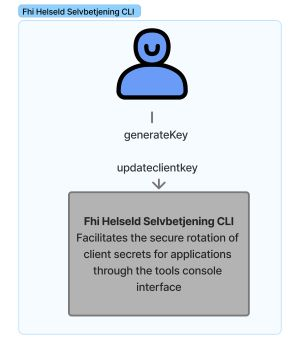

# HelseID CLI Tool

Developer and operations tools to work with HelseID clients and registrations for FHI

## Usage

See [Documentation](https://fhidev.github.io/Fhi.HelseId.Tools/)

### Client secret tool
[Client secret tool](./ClientSecret/overview.md)

Command line tool for HelseID client configuration and key management.

