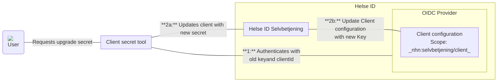

# Fhi.HelseId.Tools
Developer and operations tools to work with HelseID clients and registrations for FHI

## Tool for update HelseIdcClient secrets (Jwk)

### Update client with new keys

In order for an application to use the tool the Client must have registered _nhn:selvbetjening/client_ scope. Below is flow of how dataflow works

1. **User Request:** A user initiates a request to upgrade/rotate the client secret for an application through the tools console interface.
2. **Authentication:** The Client Secret Tool authenticates with Helse ID using the old secret and client ID to verify its identity to get an access token.
3. **Secret Update Process:** The tool updates the client configuration throuhg the Helse ID Selvbetjening API passing the access token. The updated secret is then stored in the Client Configuration inside Helse ID.

