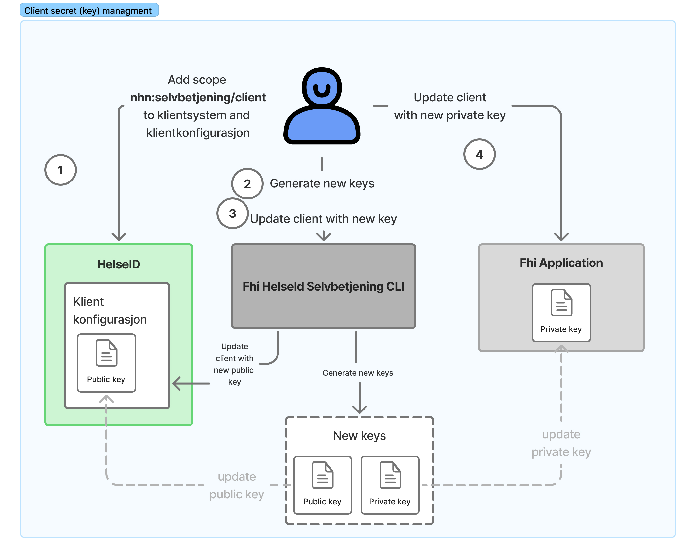

# About HelseId Client secrets (Jwk)

Client Secret Tool is a console application that facilitates the secure rotation of client secrets for applications integrated with Helse ID. A user initiates a request to upgrade/rotate the client secret for an application through the tools console interface. The tool provides commands for:

- **Generation of new keys** Command for generate new private and public Json Web Keys (jwk). See [overview of key generation commands](./generatekey-command.md)
- **Update client keys in HelseID client configuration:** Command for update secrets (public key) on a HelseID client. See [overview of update client secret commands](./client-secret-update-commands.md)
- **Read client secret expiration:** Command for reading the expiration date of client secrets to enable automated monitoring and renewal scheduling. See [overview of read client secret expiration commands](./read-client-secret-expiration-command.md)

The image below illustrates the steps for updating a client keys (secrets)

1. **Update Klientkonfiguration scope:** In order for an application to use the tool the Client must have registered _nhn:selvbetjening/client_ scope. The scope _nhn:selvbetjening/client_ to klientsystem must be added to the client system and klientkonfigurasjon
1. **Generate new keys:** The tool generate two new json web keys (jwk), private and public, with the command `generatekey`. The public key is used by HelseID to validate the client assertion. The private key is used by the application to generate a client assertion token.
1. **Update client with publik key:** After new keys are generated HelseId should be updated with the new public key with the command `updateclientkey`.
1. **Update application with private key**: The application configuration must be updated with the new private key.
