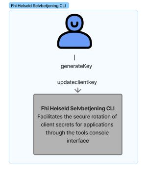

Developer and operations tools to work with HelseID clients and registrations for FHI

## Getting started

  

    <h3>Client secret command tool</h3>
    
 </img>

    <a href="./ClientSecret/command-overview">Getting started →</a>
  

  

    <h3>Code lab - Sample code for bash and powershell</h3>
    

    Run sample code from documentation directly with .NET Interactive or Jupyter lab
    <a href="./ClientSecret/code-lab/about-codelab">Code lab →</a>
    

  

