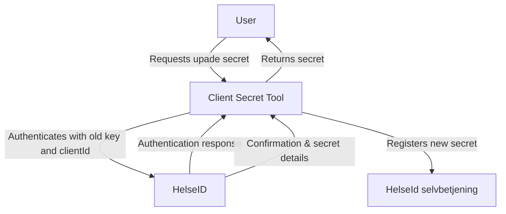

# HelseID client key updater tool




## Commands

### Generate new keys

```
 generatekey --FileName <NAME> --KeyPath <PATH>
```

### Update client with new keys


```
 updateclientkey --ClientId <CLIENT_ID_> --NewKey <NEW_KEY_> --env dev --OldKey <OLD_KEY_>
```


```
 updateclientkey --ClientId <CLIENT_ID_> --NewKeyPath <PATH> --env dev --OldKeyPath <PATH>
```

## Publish new version
```
dotnet publish -c Release -r win-x64 --self-contained true -p:PublishSingleFile=true -p:IncludeNativeLibrariesForSelfExtract=true
```
