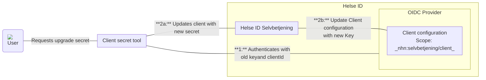

# HelseID client key updater tool

## Description
Client Secret Tool is a console application that facilitates the secure rotation of client secrets for applications integrated with Helse ID.
The tool also provide generation of new private and public Json Web Keys (jwk)


### Generate new keys

#### Commands

```
 generatekey --FileName <NAME> --KeyPath <PATH>
```

### Update client with new keys

In order for an application to use the tool the Client must have registered _nhn:selvbetjening/client_ scope. Below is flow of how dataflow works



1. **User Request:** A user initiates a request to upgrade/rotate the client secret for an application through the tools console interface.
2. **Authentication:** The Client Secret Tool authenticates with Helse ID using the old secret and client ID to verify its identity to get an access token.
3. **Secret Update Process:** The tool updates the client configuration throuhg the Helse ID Selvbetjening API passing the access token. The updated secret is then stored in the Client Configuration inside Helse ID.


#### Commands

```
 updateclientkey --ClientId <CLIENT_ID_> --NewKey <NEW_KEY_> --env dev --OldKey <OLD_KEY_>
```


```
 updateclientkey --ClientId <CLIENT_ID_> --NewKeyPath <PATH> --env dev --OldKeyPath <PATH>
```